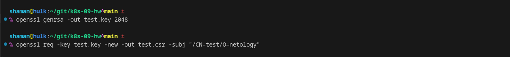
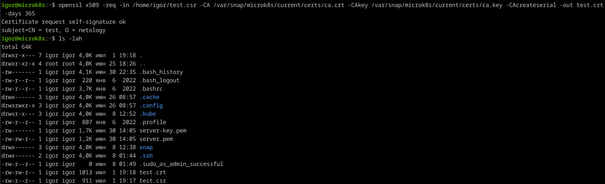
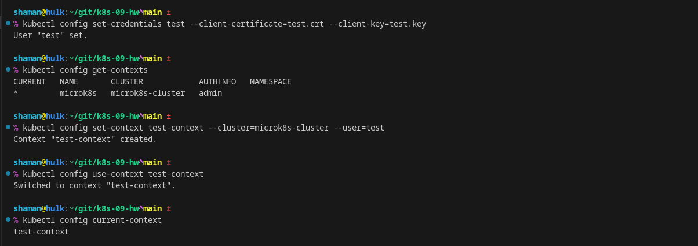
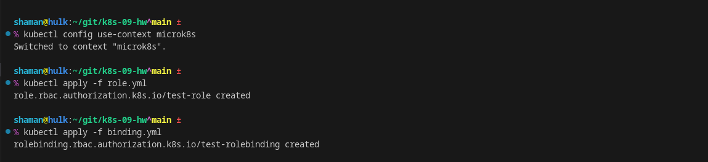

# Домашнее задание к занятию «`Управление доступом`» - `Живарев Игорь`

### Цель задания

В тестовой среде Kubernetes нужно предоставить ограниченный доступ пользователю.

------

### Чеклист готовности к домашнему заданию

1. Установленное K8s-решение (например, MicroK8s).
2. Установленный локальный kubectl.
3. Редактор YAML-файлов с подключённым GitHub-репозиторием.

------

### Инструменты и дополнительные материалы, которые пригодятся для выполнения задания

1. [Описание](https://kubernetes.io/docs/reference/access-authn-authz/rbac/) RBAC.
2. [Пользователи и авторизация RBAC в Kubernetes](https://habr.com/ru/company/flant/blog/470503/).
3. [RBAC with Kubernetes in Minikube](https://medium.com/@HoussemDellai/rbac-with-kubernetes-in-minikube-4deed658ea7b).

------

### Задание 1. Создайте конфигурацию для подключения пользователя

1. Создайте и подпишите SSL-сертификат для подключения к кластеру.
2. Настройте конфигурационный файл kubectl для подключения.
3. Создайте роли и все необходимые настройки для пользователя.
4. Предусмотрите права пользователя. Пользователь может просматривать логи подов и их конфигурацию (`kubectl logs pod <pod_id>`, `kubectl describe pod <pod_id>`).
5. Предоставить манифесты, а также скриншоты или вывод необходимых команд.

------

### Правила приёма работы

1. Домашняя работа оформляется в своём GitHub-репозитории в файле README.md. Выполненное домашнее задание пришлите ссылкой на .md-файл в вашем репозитории.
2. Файл README.md должен содержать скриншоты вывода необходимых команд `kubectl`, а также скриншоты результатов.
3. Репозиторий должен содержать тексты манифестов или ссылки на них в файле README.md.

------


## Ответ

Создайте и подпишите SSL-сертификат


Коммандой `% scp ~/git/k8s-09-hw/test.csr igor@microk8s:/home/igor/` переносим `test.csr` на сервер с `microk8s`.

Подписываем сертификат


Конфигурационный файл `kubectl`


Создайте роли и все необходимые настройки для пользователя


Проверяем права пользователя
```
shaman@hulk:~/git/k8s-09-hw^main ±
% kubectl config use-context test-context                                                                                              
Switched to context "test-context".

shaman@hulk:~/git/k8s-09-hw^main ±
% kubectl apply -f deploy_nginx.yml                                                                                                                         
error: unable to read client-cert /home/shaman/git/k8s-09-hw/test.crt for test due to open /home/shaman/git/k8s-09-hw/test.crt: no such file or directory
```

Коммандой `scp igor@microk8s:/home/igor/test.crt /home/shaman/git/k8s-09-hw` забираем `test.crt` с сервера `microk8s`.

```
shaman@hulk:~/git/k8s-09-hw^main ±
% kubectl apply -f deploy_nginx.yml -n netology                                                                                                                  :( 1 24-07-01 - 22:31:37
deployment.apps/dpl-nginx created

shaman@hulk:~/git/k8s-09-hw^main ±
% kubectl get po                                                                                                                                                      24-07-01 - 22:32:02
No resources found in default namespace.

shaman@hulk:~/git/k8s-09-hw^main ±
% kubectl get po -n netology                                                                                                                                          24-07-01 - 22:32:23
NAME                        READY   STATUS    RESTARTS   AGE
dpl-nginx-cc7b6dcbc-nfpfb   1/1     Running   0          43s

shaman@hulk:~/git/k8s-09-hw^main ±
% kubectl describe -n netology po dpl-nginx-cc7b6dcbc-nfpfb                                                                                                           24-07-01 - 22:32:47
Name:             dpl-nginx-cc7b6dcbc-nfpfb
Namespace:        netology
Priority:         0
Service Account:  default
Node:             microk8s/192.168.10.141
Start Time:       Mon, 01 Jul 2024 22:32:06 +0300
Labels:           app=web
                  pod-template-hash=cc7b6dcbc
Annotations:      cni.projectcalico.org/containerID: ca131bfa2b633e94ab301851d2f710042d3c80546db225a0046ee1aca1c6241a
                  cni.projectcalico.org/podIP: 10.1.128.253/32
                  cni.projectcalico.org/podIPs: 10.1.128.253/32
Status:           Running
IP:               10.1.128.253
IPs:
  IP:           10.1.128.253
Controlled By:  ReplicaSet/dpl-nginx-cc7b6dcbc
Containers:
  nginx:
    Container ID:   containerd://c662bb720b412b81ca1c8d44f98620fead956d733cae44eee3beae0dcd89badf
    Image:          nginx:1.19.2
    Image ID:       docker.io/library/nginx@sha256:c628b67d21744fce822d22fdcc0389f6bd763daac23a6b77147d0712ea7102d0
    Port:           80/TCP
    Host Port:      0/TCP
    State:          Running
      Started:      Mon, 01 Jul 2024 22:32:16 +0300
    Ready:          True
    Restart Count:  0
    Environment:    <none>
    Mounts:
      /var/run/secrets/kubernetes.io/serviceaccount from kube-api-access-v9hqv (ro)
Conditions:
  Type                        Status
  PodReadyToStartContainers   True 
  Initialized                 True 
  Ready                       True 
  ContainersReady             True 
  PodScheduled                True 
Volumes:
  kube-api-access-v9hqv:
    Type:                    Projected (a volume that contains injected data from multiple sources)
    TokenExpirationSeconds:  3607
    ConfigMapName:           kube-root-ca.crt
    ConfigMapOptional:       <nil>
    DownwardAPI:             true
QoS Class:                   BestEffort
Node-Selectors:              <none>
Tolerations:                 node.kubernetes.io/not-ready:NoExecute op=Exists for 300s
                             node.kubernetes.io/unreachable:NoExecute op=Exists for 300s
Events:
  Type    Reason     Age   From               Message
  ----    ------     ----  ----               -------
  Normal  Scheduled  89s   default-scheduler  Successfully assigned netology/dpl-nginx-cc7b6dcbc-nfpfb to microk8s
  Normal  Pulled     82s   kubelet            Container image "nginx:1.19.2" already present on machine
  Normal  Created    80s   kubelet            Created container nginx
  Normal  Started    79s   kubelet            Started container nginx

shaman@hulk:~/git/k8s-09-hw^main ±
% kubectl logs -n netology dpl-nginx-cc7b6dcbc-nfpfb                                                                                                             :( 1 24-07-01 - 22:33:58
/docker-entrypoint.sh: /docker-entrypoint.d/ is not empty, will attempt to perform configuration
/docker-entrypoint.sh: Looking for shell scripts in /docker-entrypoint.d/
/docker-entrypoint.sh: Launching /docker-entrypoint.d/10-listen-on-ipv6-by-default.sh
10-listen-on-ipv6-by-default.sh: Getting the checksum of /etc/nginx/conf.d/default.conf
10-listen-on-ipv6-by-default.sh: Enabled listen on IPv6 in /etc/nginx/conf.d/default.conf
/docker-entrypoint.sh: Launching /docker-entrypoint.d/20-envsubst-on-templates.sh
/docker-entrypoint.sh: Configuration complete; ready for start up

```

Листинг `deploy_nginx.yml`:
```
apiVersion: apps/v1
kind: Deployment
metadata:
  labels:
    app: web
  name: dpl-nginx
  namespace: netology
spec:
  selector:
    matchLabels:
      app: web
  replicas: 1
  template:
    metadata:
      labels:
        app: web
    spec:
      containers:
      - name: nginx
        image: nginx:1.19.2
        ports:
        - containerPort: 80
```


Листинг `role.yml`:
```
apiVersion: rbac.authorization.k8s.io/v1
kind: Role
metadata:
  name: test-role
  namespace: netology
rules:
  - apiGroups: [""]
    resources: ["pods", "pods/log"]
    verbs: ["get", "watch", "list"]
```


Листинг `binding.yml`:
```
apiVersion: rbac.authorization.k8s.io/v1
kind: RoleBinding
metadata:
  name: test-rolebinding
  namespace: netology
subjects:
  - kind: User
    name: test
    apiGroup: rbac.authorization.k8s.io
roleRef:
  kind: Role
  name: test-role
  apiGroup: rbac.authorization.k8s.io
```

------